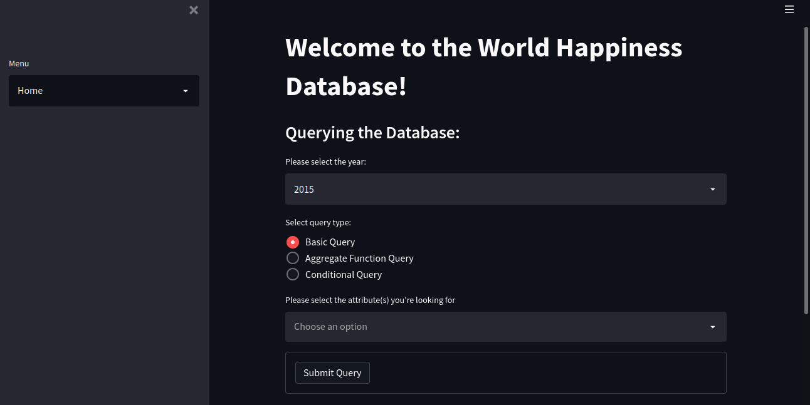
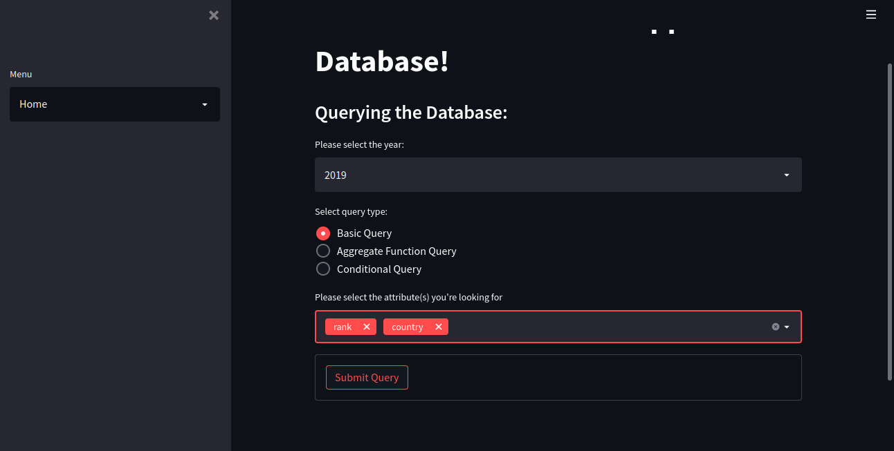
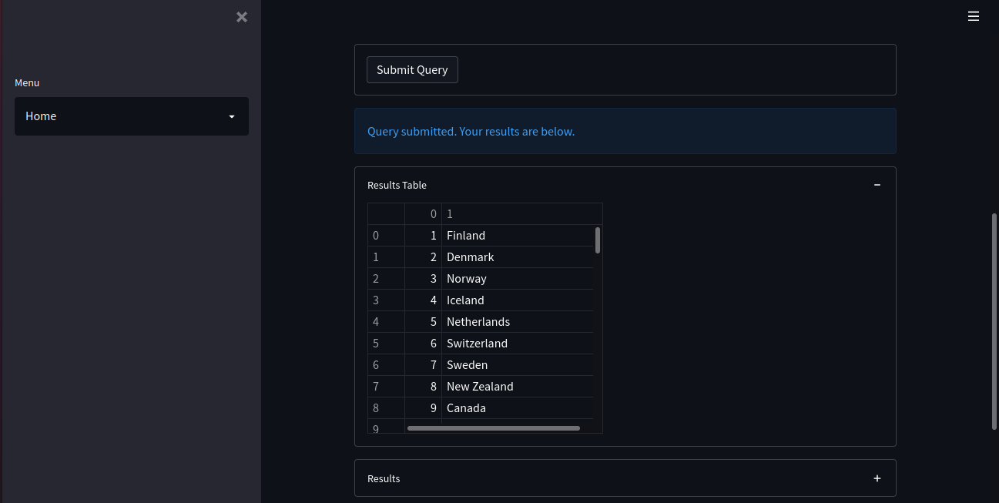
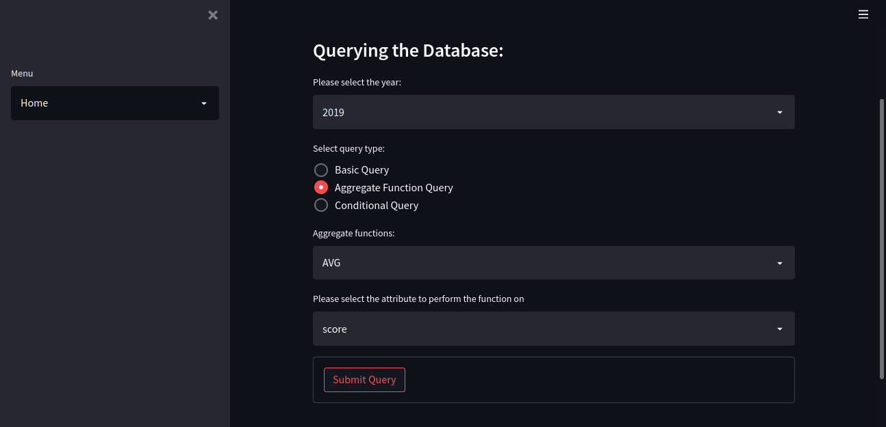
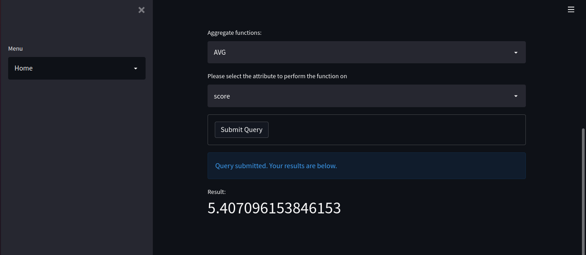
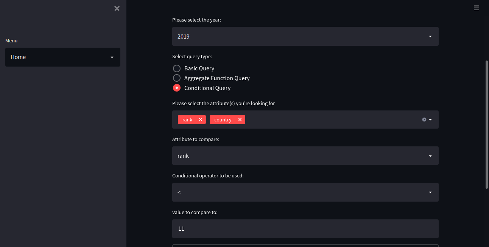
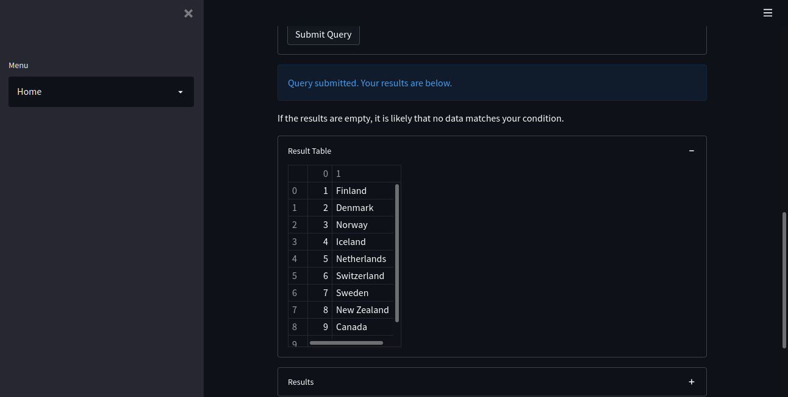

# Welcome to the World Happiness Database Manager!

## What is it?

The World Happiness Database Manager is a Python program developed for querying an SQLite database.

This project uses the [World Happiness Report dataset](https://www.kaggle.com/datasets/unsdsn/world-happiness) retrieved from Kaggle. The database contains information pertaining to the rates of happiness in 155 countries from the year 2015 to the year 2019. The database contains factors that attribute to a country's happiness score including generosity, trust in government, feelings of freedom, health, and the economy. These factors are measured by surveying the public's opinion of them in their country on a scale from 1 to 10, then calculating the average of their responses.

This repository includes:

- the database manager: `src/happinessDBM.py`
- the database: `src/happinessDB.sqlite3`
- the database builder file: `builderFile.txt`
- the data: `data/2015.csv`, `data/2016.csv`, `data/2017.csv`, `data/2018.csv`, `data/2019.csv`

## How does it work?

The World Happiness Database Manager uses Python and Streamlit to develop a user interface in order to access the SQLite database. This interface is designed to allow users to comfortably query the database without having any knowledge of SQL.

Please note that in order to run the program, you will need the Streamlit Python library or a virtual environment with the dependencies. If you already have Python and pip, you can install Streamlit by entering the following command in your terminal:

```
pip install streamlit
```

To run the program, enter the following command in your terminal:

```
streamlit run src/happinessDBM.py
```

Open your browser to http://localhost:8501/ to view the interface. You'll see an interactive form to fill out to submit a query. For more information on each type of query option, navigate to the About page from the Menu on the left side of the page.

## What does it look like?

The following image is the Homepage of the database manager. The Homepage displays the specified year, the query type, and the attribute of the database:



When selecting Basic Query in the query type section, the user will be able select specific attributes that they are looking for:



The results of the Basic Query will be displayed in a table which will be numbered from greatest to least:



When selecting Aggregate Query in the query type section, the user will be able to choose from options such as average, minimum, maximum, sum, and count:



The results of the Aggregate Query will be displayed by a float that goes up to fifteen digits after the decimal point:



When selection Conditional Query in the query type section, the user will be able to compare values in a table to other values:



The results of the Aggregate Query will be displayed in a table which will be numbered from greatest to least. 


